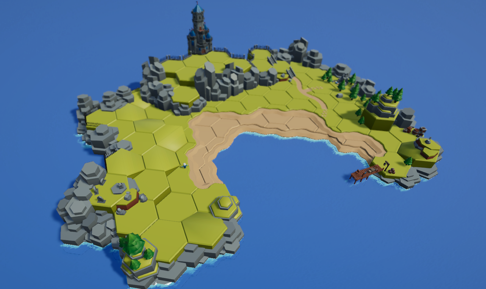

# HexMapper-Unity

### Hexagonal Tile Grid Snapping Tool for Unity

## Introduction
HexMapper is a Unity tool designed to snap 3D hexagonal tiles to a hex grid. It was originally made for use with hexagon tilesets by [Kay Lousberg](https://kaylousberg.itch.io/).

## Installation
1. Download `HexMapper.cs` from `/Scripts`.
2. Place the file into your Unity project's `Scripts` folder.
3. Attach the HexMapper script to a GameObject, and it will snap in the scene view of the editor.

## Inspector Settings
- **Hex Type**: Change the hexagon orientation type between POINT top and FLAT top. You can turn a POINT top hexagon into a FLAT top by rotating it 30 degrees. KayKit Hex Tilesets are POINT top by default.
- **Hex Grid Snap Active**: Activate or deactivate grid snapping for this object. Used to keep grid snapping separate from Y snapping.
- **Hex Snap Source**: Determines the hex interval for snapping. `SCALE` uses the X-Scale value, while `CUSTOM` allows for a user-defined interval independent of the object's scale. Use `SCALE` if the scale of the object matches its size (default for KayKit hex tiles).
- **Custom Hex Interval**: Defines the snap interval when `Hex Snap Source` is set to `CUSTOM`.
- **Y Snap Active**: Toggles Y-axis snapping independently from grid snapping.
- **Y Snap**: The Y-axis snap interval used if Y snapping is active.

## The Problem
Unity currently lacks reliable, built-in methods for snapping 3D objects to a hexagonal grid. The existing options are:
1. **Grid Snap Gizmo** in the scene view, which doesn’t support hexagonal grids.
2. **TileMap with the GameObject brush**, which does support hex grids, but can be inconsistent and frustrating to use.

## The Solution
HexMapper provides a simple `MonoBehaviour` script that attaches to your hexagon GameObject or prefab. This allows snapping to a customizable hex grid interval, so each instance of your prefab will align consistently with your hex grid settings.

## Features
- **Editor-Only**: Runs in the editor, not during runtime.
- **Hex Grid Snapping**: Snaps a GameObject or prefab to a hex grid.
- **Y-Axis Snapping**: Snaps a GameObject to the Y-axis, independent of the hex grid.
- **Hex Tile Support**: Supports both point-top and flat-top hexagon tiles.
- **Customizable Grid Interval**: Defaults to the X-scale of your GameObject but can be customized.
- **Independent Toggle for Grid and Y Snapping**: Each can be turned on or off independently.
- **Multiple Object Snap**: Snaps multiple selected GameObjects to the grid while maintaining their relative positions.

## Limitations
- **No Grid Lines**: Does not display grid lines in the scene view.
- **Uniform Scale Only**: Does not support objects with different X and Z scales. (Ignores Y scaling).
- **Performance with Large Numbers of Tiles**: Has not been tested extensively with a large number of tiles; performance may vary.
- **Square Grid Support**: Does not support snapping to a traditional square grid.
- **XY Plane Snapping**: Does not support tile snapping in the XY plane (e.g., Unity 2D), but adapting the script for this should be straightforward.

## Feedback
This tool was developed for personal use but is provided here for anyone who finds it helpful. While I will address bugs as they come up, future updates will be as-needed based on my own development needs.

If you encounter any bugs or issues, please let me know. I’ll do my best to address them. Thanks for trying out HexMapper!
